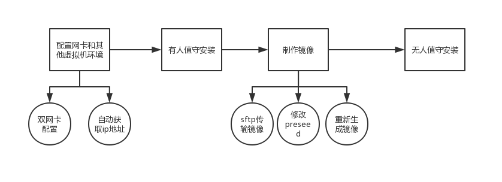
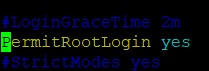
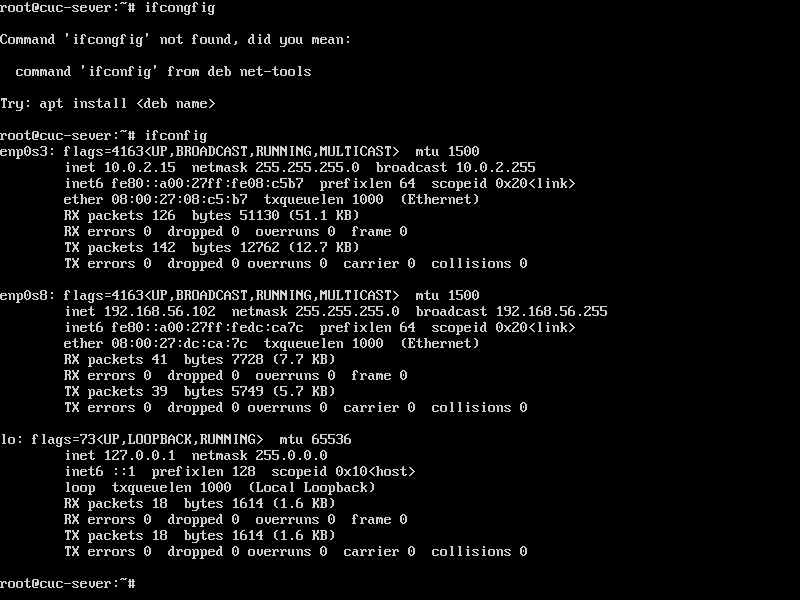
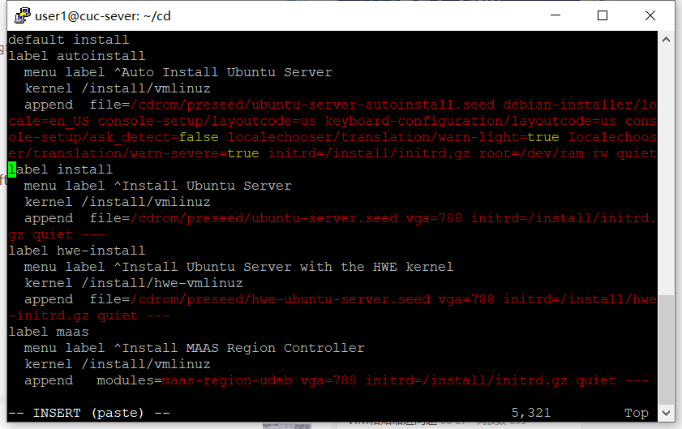
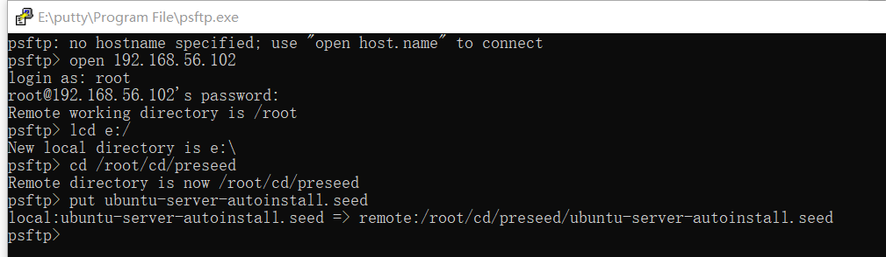
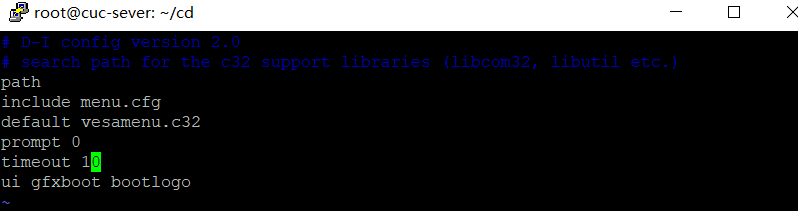
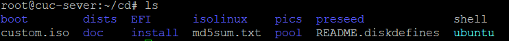
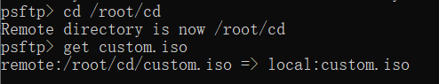

# 无人值守Linux安装镜像制作

# 实验目的

- 基于ubuntu-18.04.4-server-amd64.iso制作无人值守自动安装的Linux镜像

# 实验环境


- 宿主机：Windows
- 虚拟机：Ubuntu-18.04.4-Server-amd64.iso
- Virtualbox
- putty
- psftp


# 实验步骤



## 1.root用户在putty上远程登录

修改ssh服务配置文件
```markdown
sudo vi /etc/ssh/sshd_config
```
调整PermitRootLogin参数值为yes，如下图：


登陆配置好双网卡的ubuntu中
```markdown
# 查看IP地址
Ifconfig 
```


## 2.传输文件

用psftp把ubuntu-18.04.4-server-amd64.iso从Windows传到虚拟机

- 在psftp弹出来的命令框中，用命令“open+IP地址”连接对应要传输的目的虚拟机

- 传输文件到linux系统中
用命令"put+文件名"

## 3.制作过程

```markdown
# 根据实际情况，自行替换其中的参数
# 在当前用户目录下创建一个用于挂载iso镜像文件的目录
mkdir loopdir

# 挂载iso镜像文件到该目录
mount -o loop ubuntu-18.04.1-server-amd64.iso loopdir

# 创建一个工作目录用于克隆光盘内容
mkdir cd
 
# 同步光盘内容到目标工作目录
# 一定要注意loopdir后的这个/，cd后面不能有/
rsync -av loopdir/ cd

# 卸载iso镜像
umount loopdir

# 进入目标工作目录
cd cd/

# 编辑Ubuntu安装引导界面增加一个新菜单项入口
vim isolinux/txt.cfg

# 在第二行default下添加：
label autoinstall
  menu label ^Auto Install Ubuntu Server
  kernel /install/vmlinuz
  append  file=/cdrom/preseed/ubuntu-server-autoinstall.seed debian-installer/locale=en_US console-setup/layoutcode=us keyboard-configuration/layoutcode=us console-setup/ask_detect=false localechooser/translation/warn-light=true localechooser/translation/warn-severe=true initrd=/install/initrd.gz root=/dev/ram rw quiet
```


- 使用老师提供的seed
- 用psftp传送至虚拟机
```markdown
# 设置宿主机要保存文件的地址
lcd e:/  #保存在E盘
```



```
# 修改配置缩短超时等待时间
	# timeout 10
	sudo vi isolinux/isolinux.cfg
```


```markdown
# 修改md5sum文件的权限，原来只读更改为可写：
chmod 666 md5sum.txt

# 重新生成md5sum.txt
cd ~/cd && find . -type f -print0 | xargs -0 md5sum > md5sum.txt

# 封闭改动后的目录到.iso

IMAGE=custom.iso
BUILD=~/cd/

mkisofs -r -V "Custom Ubuntu Install CD" \
            -cache-inodes \
            -J -l -b isolinux/isolinux.bin \
            -c isolinux/boot.cat -no-emul-boot \
            -boot-load-size 4 -boot-info-table \
            -o $IMAGE $BUILD

# 如果目标磁盘之前有数据，则在安装过程中会在分区检测环节出现人机交互对话框需要人工选择
```

成功后，可以看到刚才BUILD的路径下有custom文件


- 用psftp从虚拟机上get custom.iso


# 实验结果

- 新建一个虚拟机，添加custom.iso


# 实验问题
## 1.如何配置无人值守安装iso并在Virtualbox中完成自动化安装。
以上实验过程

## 2.Virtualbox安装完Ubuntu之后新添加的网卡如何实现系统开机自动启用和自动获取IP？

ubuntu以DHCP方式配置网卡自动获取ip
编辑文件/etc/network/interfaces：
```markdown
sudo vi /etc/network/interfaces
```
并用下面的行来替换有关eth0的行：

```
# The primary network interface - use DHCP to find our address
auto eth0
iface eth0 inet dhcp。
```
## 3.如何使用sftp在虚拟机和宿主机之间传输文件？

用psftp把文件从Windows传到虚拟机

- 在psftp弹出来的命令框中，用命令“open+IP地址”连接对应要传输的目的虚拟机
```markdown
# 设置宿主机要保存文件的地址
lcd e:/  #保存在E盘
put 文件名
get 文件名

```

## 4.ubuntu-server-autoinstall.seed，请自行和官方示例文件进行比对
添加多种支持本地支持语言（en，zh），跳过安装时语言支持的设置
设置链路等待超时和DHCP超时为5s，选择手动配置网络
设置主机名svr.sec.cuc.edu.cn
设置域名dns.sec.cuc.edu.cn
设置普通用户为cuc，密码cuc
设置时区，安装期间不实用NTP设置时钟
LVM分区中逻辑卷设置为最大。分成/home，/var和/tmp三个分区（multi）
安装时不实用网络镜像
将版本由桌面版修改为服务器版
将更新政策由空修改为不参与更新
安装build-essential包提供包的依赖信息

# 体会与感悟

- vim编辑退出
```
:w 保存文件但不退出vi 
:w file 将修改另外保存到file中，不退出vi 
:w! 强制保存，不推出vi 
:wq 保存文件并退出vi 
:wq! 强制保存文件，并退出vi 
:q 不保存文件，退出vi 
:q! 不保存文件，强制退出vi 
:e! 放弃所有修改，从上次保存文件开始再编辑命令历史
```

- 直接运行mount命令挂载分区一定要root权限

# 遇到的问题

## 1.安装genisoimage

执行mkisofs命令时，需要安装genisoimage

```
Apt install genisoimage.
```
遇到如下错误

先执行reboot重启，再执行apt-get update，再安装
apt-get update太慢，网上搜索修改/etc/apt/sources.list 内容

# 参考资料
https://blog.csdn.net/qq_42773814/article/details/81213620?depth_1-utm_source=distribute.pc_relevant.none-task&utm_source=distribute.pc_relevant.none-task
https://github.com/suancaiji/linux-2019-Wzy-CC/blob/Lab0x01/%E6%97%A0%E4%BA%BA%E5%80%BC%E5%AE%88%E5%AE%89%E8%A3%85Ubuntu%E9%95%9C%E5%83%8F.md
https://github.com/suancaiji/linux-2019-TheMasterOfMagic/blob/chap0x01/chap0x01/%E6%97%A0%E4%BA%BA%E5%80%BC%E5%AE%88Linux%E5%AE%89%E8%A3%85%E9%95%9C%E5%83%8F%E5%88%B6%E4%BD%9C.md
https://blog.csdn.net/zilaike/article/details/78922524
