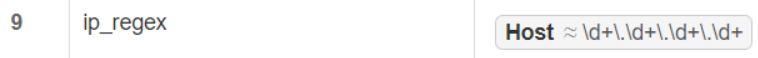
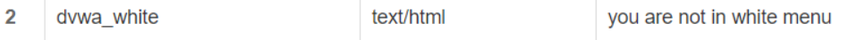
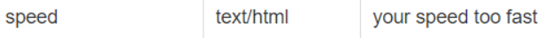

# 第五章实验报告

# 实验步骤
注: 以下所有`bash`指令均以`root`用户身份执行. 建议实验开始前先执行一遍`apt update`

## Part 1 基本要求
<details>
    <summary>Step 0 修改本地hosts文件</summary>
    - 首先先修改本地hosts文件, 将以下3个域名解析为`Ubuntu`的IP地址
  
  ```bash
     # windows下hosts文件路径
     C:\Windows\System32\drivers\etc
  
     # 添加如下内容
     192.168.56.102 wp.sec.cuc.edu.cn 
     192.168.56.102 dvwa.sec.cuc.edu.cn
     192.168.56.102 verynginx.sec.cuc.edu.cn
 ```
</details>


<details> 
<summary>Step 1 下载安装VeryNginx</summary>

- 下载安装verynginx
- 
    ```bash
    #首先克隆verynginx的仓库到ubuntu18虚拟机中，然后进入仓库目录，运行安装语句，即可直接安装 VeryNginx 和 OpenResty。
    git clone https://github.com/alexazhou/VeryNginx.git
    cd VeryNginx
    python install.py install

    # 修改配置文件修改/opt/verynginx/openresty/nginx/conf/nginx.conf配置文件的第二行, 设置工作进程的用户为www-data
    sed -i "2s/nginx/www-data/" nginx.conf

    #修改server监听端口为192.168.56.102:80
    

    # 创建软链接方便自己之后使用
    ln -s /opt/verynginx/openresty/nginx/sbin/nginx /usr/sbin/verynginx

    # 检查配置文件是否正确
    verynginx -t

    # 若正确则启动verynginx
    verynginx
    ```
- 用浏览器打开虚拟机的ip地址，192.168.56.102，登录页如下，输入用户名verynginx和密码verynginx
    
    
- 开启、停止、重启
  ```bash

  #启动服务
  /opt/verynginx/openresty/nginx/sbin/nginx

  #停止服务
  /opt/verynginx/openresty/nginx/sbin/nginx -s stop

  #重启服务
  /opt/verynginx/openresty/nginx/sbin/nginx -s reload
  ```
</details>
<details>


<summary>Step 2 下载安装Nginx</summary>


- 在下载前先执行`verynginx -s stop`以停止`VeryNginx`, 避免与稍后自启动的`nginx`产生冲突
   
```bash
#安装nginx
sudo apt install nginx

#修改nginx server端口监听80
sudo vim /etc/nginx/sites-enabled/default

#修改监听端口为80  并保存退出
 listen 80 default_server;
 
 #启动nginx 
 sudo systemctl start nginx
```

- 执行`nginx -s stop`以停止`Nginx`
</details>


<details>
<summary>Step 3 下载安装配置WordPress</summary>

- 安装mysql数据库
```bash
#下载安装mysql数据库
sudo apt install mysql-server

sudo mysql

#创建数据库：
CREATE DATABASE wordpress DEFAULT CHARACTER SET utf8 COLLATE utf8_unicode_ci;

#创建一个新用户，刷新并退出：
GRANT ALL ON wordpress.* TO 'wpuser'@'localhost' IDENTIFIED BY 'password';
FLUSH PRIVILEGES;
EXIT;

```

- 安装php，并配置nginx使用php
```bash
#安装php
sudo add-apt-repository universe
sudo apt install php-fpm php-mysql


#修改nginx配置PHP-FPM进程的反向代理配置在nginx服务器上 保存退出
sudo vim /etc/nginx/sites-enabled/default

     location ~ \.php$ {
         include snippets/fastcgi-php.conf;
          fastcgi_pass unix:/var/run/php/php7.2-fpm.sock;
     }
     
 #重新启动nginx使配置生效
 sudo systemctl restart nginx
```

- 下载wordpress-4.7到/var/www/html/wp.sec.cuc.edu.cn目录下

    ```bash
    # 修改文件夹属主为 www-data
    $ sudo chown -R www-data:www-data /var/www/wordpres
    ```
- 配置nginx
    ```bash
    #修改nginx配置 
    sudo vim /etc/nginx/sites-enabled/default

    #将网站根站点修改为wordpress的安装目录 并保存退出
    root /var/www/html/wp.sec.cuc.edu.cn;
    ```
</details>


<details>
<summary>Step 4 连接VeryNginx-Nginx-WordPress</summary>

- 连接`Nginx`与`WordPress`:
    ```bash
    # 为wordpress创建配置文件/etc/nginx/sites-available/wp.sec.cuc.edu.cn
    server {
    listen 8080;
    listen [::]:8080 ipv6only=on;

    root /var/www/html/wp.sec.cuc.edu.cn;

    index index.php index.html index.htm index.nginx-debian.html;

    server_name 192.168.56.102;

    location / {

            try_files $url/=404;
    }

    location ~ \.php$ {
            include snippets/fastcgi-php.conf;
            fastcgi_pass unix:/var/run/php/php7.2-fpm.sock;
    }


    # 在sites-enabled目录下创建一个该可用站点的软链接, 同时删除该目录下的default文件以禁用该站点  
   sudo ln -s /etc/nginx/sites-available/wp.sec.cuc.edu.cn /etc/nginx/sites-enabled/

    rm /etc/nginx/sites-enabled/default
    # 检查配置文件是否正确
    nginx -t
    # 若正确则启动Nginx
    nginx
    ```
- 连接`VeryNginx`与`Nginx`, 这一步我们通过`VeryNginx`的图形界面来实现
    - 首先进入管理页, 点击`config`标签进入配置页
    - 添加如下`Matcher`  
        
    - 添加如下`Up Stream`
        
    - 添加如下`Proxy Pass`  
        
- 访问`wp.sec.cuc.edu.cn`, 如果能出现以下界面说明当前阶段配置正确
    
</details>


<details>
<summary>Step 5 DVWA</summary>

- 仿照上述步骤类似安装配置即可  
    ```bash

    # 首先下载DVWA，并移动到指定文件夹中,执行完毕后 /var/www/html文件夹下会有一个DVWA的子文件夹。

    sudo git clone https://github.com/ethicalhack3r/DVWA /tmp/DVWA
    sudo mv /tmp/DVWA /var/www/html

    #重命名DVWA中的**/config/config.inc.php.dist为/config/config.inc.php**
    sudo cp /var/www/html/DVWA/config/config.inc.php.dist /var/www/html/DVWA/config/config.inc.php
    ```

- 在mysql为DVWA新建一个用户名, 修改DVWA中的配置,用于连接mysql数据库
    ```bash    
    mysql
    #新建一个数据库dvwa
    CREATE DATABASE dvwa DEFAULT CHARACTER SET utf8 COLLATE utf8_unicode_ci;

    #新建一个用户dvwauser，分配管理dvwa的权限，设置密码 刷新并退出
    GRANT ALL ON dvwa.* TO 'dvwauser'@'localhost' IDENTIFIED BY 'password';
    FLUSH PRIVILEGES;
    EXIT;
    #重启mysql生效
    sudo systemctl restart mysql
 
    #打开DVWA的配置文件
    sudo vim /var/www/html/DVWA/config/config.inc.php
 
    #修改配置文件为自己需要的内容 保存退出
    $_DVWA[ 'db_server' ]   = '127.0.0.1';
    $_DVWA[ 'db_database' ] = 'dvwa';
    $_DVWA[ 'db_user' ]     = 'dvwauser';
    $_DVWA[ 'db_password' ] = 'p@ssw0rd';
- 修改php的配置
    ```bash
    #查看php版本   
    php -v    版本为7.2

    #修改配置文件 并保存退出
    sudo vim /etc/php/7.2/fpm/php.ini

    #设置以下项目
    allow_url_include = on
    allow_url_fopen = on
    safe_mode = off
    magic_quotes_gpc = off
    display_errors = off

    #修改完以后重启php-fpm使配置生效
    sudo systemctl restart php7.2-fpm
    ```

- 设置DVWA文件夹访问权限
    ```bash
    sudo chown -R www-data.www-data /var/www/html/DVWA
    ```
- 配置nginx 5566端口监听DVWA的访问
    ```bash
    
    #打开nginx配置文件
    sudo vim /etc/nginx/sites-enabled/default

    #添加对应的监听模块
    server {
        listen 5566；
        root /var/www/html/DVWA;
        index index.html setup.php index.htm index.php index.nginx-debian.html;
         location / {
                try_files $uri $uri/ =404;
          }
        #配置php-fpm反向代理
        location ~ \.php$ {
                include snippets/fastcgi-php.conf;
                fastcgi_pass unix:/var/run/php/php7.2-fpm.sock;
        }
    }

    #重启nginx使配置生效
    sudo systemctl restart nginx
    ```

- 之后在`VeryNginx`管理页面中添加相应的`Matcher`, `Up Stream`与`Proxy Pass`. 
- 此时访问dvwa，显示如下  
    
- 并点击setup.php页面下方的Create/Reset Database生成需要使用的数据库。如果数据库连接成功，页面会直接重定向到登录页面，如下图，使用 admin/password登录。
</details>

## Part 2 基本要求
<details>
<summary>

在一台主机（虚拟机）上同时配置Nginx和VeryNginx
  - VeryNginx作为本次实验的Web App的反向代理服务器和WAF
  - PHP-FPM进程的反向代理配置在nginx服务器上，

使用Wordpress搭建的站点对外提供访问的地址为： http://wp.sec.cuc.edu.cn

使用Damn Vulnerable Web Application (DVWA)搭建的站点对外提供访问的地址为： http://dvwa.sec.cuc.edu.cn
</summary>

- 修改nginx的wordpress-http配置，设置监听端口为127.0.0.1:80，dvwa监听127.0.0.1:5566
    - 配置verynginx端口转发
      - 配置matcher
        - 
      - 配置Up Stream
        - 
      - 配置Proxy Pass
        - 

- 修改verynginx的nginx.conf配置文件,监听443
- 实验结果
      - 
      - 
    -  完成配置拓扑图
       - 
    - 相关配置文件
      - nginx配置文件
      - verynginx配置文件
      - dvwa配置文件
</details>


## Part 3 安全加固要求

<details>
<summary>使用IP地址方式均无法访问上述任意站点，并向访客展示自定义的友好错误提示信息页面-1</summary>

- 添加`Matcher`以匹配使用IP访问的方式  
    
- 添加`Response`以给出自定义的友好错误提示信息页面  
    
- 添加`filter`
    
- 此时使用`ip`地址访问会出现以下页面, 可知上述`Filter`已生效  
    
</details>

<details>
<summary>Damn Vulnerable Web Application (DVWA)只允许白名单上的访客来源IP，其他来源的IP访问均向访客展示自定义的友好错误提示信息页面-2</summary>

- Matcher  
    
- Response  
    
- Filter  
    
- 结果 
    
</details>

<details>
<summary>在不升级Wordpress版本的情况下，通过定制VeryNginx的访问控制策略规则，热修复WordPress < 4.7.1 - Username Enumeration</summary>

- 这个漏洞的利用`payload`包含了关键字`/wp-json/wp/v2/users/`, 添加一条`Matcher`在`URL`中匹配`^/wp-json/wp/v2/users.*`Block掉即可
- Matcher  
    
- Filter
    
</details>

<details>
<summary>通过配置VeryNginx的Filter规则实现对Damn Vulnerable Web Application (DVWA)的SQL注入实验在低安全等级条件下进行防护</summary>

- Matcher  
    
- Response  
    
- Filter  
    
- 结果 
    
</details>

## Part 4 VERYNGINX配置要求

<details>
<summary>VeryNginx的Web管理页面仅允许白名单上的访客来源IP，其他来源的IP访问均向访客展示自定义的友好错误提示信息页面-3</summary>

- 上文类似处理即可
- Matcher  
    
- Response
    
- Filter
    
- Result
    
</details>

<details>
<summary>通过定制VeryNginx的访问控制策略规则实现</summary>

- 限制DVWA站点的单IP访问速率为每秒请求数 < 50, 限制Wordpress站点的单IP访问速率为每秒请求数 < 20, 超过访问频率限制的请求直接返回自定义错误提示信息页面-4
    - Frequency Limit  
        
    - Response(强行428)  
        
    - Result
         
- 禁止curl访问
    - Matcher  
    
    - Filter
    
</details>


# 遇到的问题
```bash
# 查看mysql用户名密码
cd /etc/mysql 
sudo vim debian.cnf
# 登录mysql
mysql -u debian-sys-maint(或者别的用户名） -p 
use wordpress
select * from wp_options limit 3;
```

- mysql数据库里设置的密码和php指定的不一致
  

# 参考资料
[linux-2019-TheMasterOfMagic](https://github.com/suancaiji/linux-2019-TheMasterOfMagic/edit/master/chap0x05/readme.md)
[linux-2019-jackcily](https://github.com/suancaiji/linux-2019-jackcily/blob/job5/job5/%E5%AE%9E%E9%AA%8C5.md)
[how-to-install-linux-nginx-mysql-php-lemp-stack-ubuntu-18-04](https://www.digitalocean.com/community/tutorials/how-to-install-linux-nginx-mysql-php-lemp-stack-ubuntu-18-04)
[how-to-install-wordpress-with-lemp-on-ubuntu-18-04](https://www.digitalocean.com/community/tutorials/how-to-install-wordpress-with-lemp-on-ubuntu-18-04)
[how-to-create-a-self-signed-ssl-certificate-for-nginx-in-ubuntu-18-04](https://www.digitalocean.com/community/tutorials/how-to-create-a-self-signed-ssl-certificate-for-nginx-in-ubuntu-18-04)
