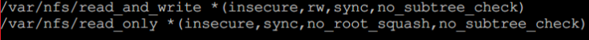
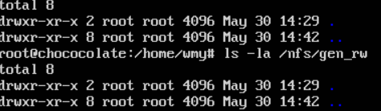
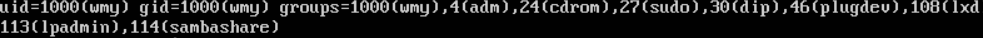
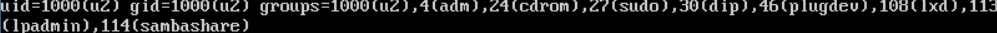
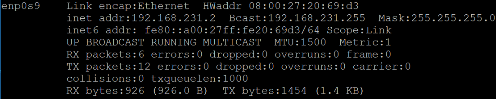
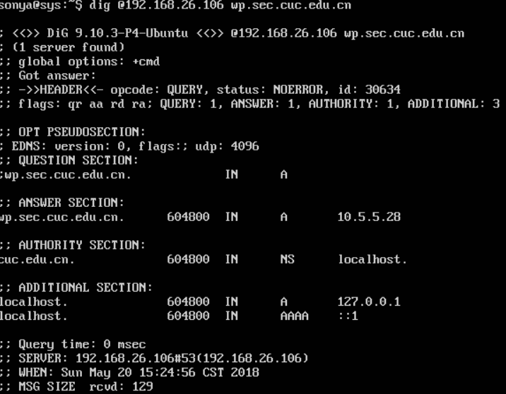

# SHELL 脚本编程练习进阶 

## 实验环境
本实验使用了两台虚拟机，均安装在virtualbox中，一台为ubuntu18.04 server，称为A, 另一台为ubuntu18.04 desktop，称为B，两台虚拟机的配置如下：

- 服务端(ubuntu-server-18.04)
  - hostonly:192.168.56.102

- 客户端(ubuntu-server-18.04)
  - hostonly:192.168.56.103

## 实验过程

### 工作主机免密SSH登录目标主机
  - 生成并导入SSH-KEY至目标主机
      - 在工作主机生成ssh-key
        ```bash
        # foo为Key的名称
        ssh-keygen -f foo
        ```
      - 修改目标主机```/etc/ssh/sshd_config```配置
        ```bash
        # 设置可通过口令认证SSH
        PasswordAuthentication yes
        # 可以root用户登录
        PermitRootLogin yes
        ```
      - 重启目标主机的SSH服务
        ```bash
        sudo systemctl restart ssh
        ```
    - 工作主机通过```ssh-copy-id```方式导入ssh-key
        ```bash
        ssh-copy-id -i ~/foo root@192.168.56.102
        ```
  - 设置免密登录
    - 取消root口令并禁用口令登录
        ```bash
        sudo passwd -l root
        # 修改目标主机配置文件
        vim /etc/ssh/sshd_config
        PasswordAuthentication no
        PermitRootLogin without-password

        # 重启ssh服务
        sudo systemctl restart ssh
        ```
  - 实验结果
    
  
----

### 一、proftpd

- [x] **配置一个提供匿名访问的FTP服务器，匿名访问者可以访问1个目录且仅拥有该目录及其所有子目录的只读访问权限**

  安装完成proftpd后，修改配置文件proftpd.conf，配置匿名用户对任意文件夹的只读权限。
  
  
  
  


- [x] **配置一个支持用户名和密码方式访问的账号，该账号继承匿名访问者所有权限，且拥有对另1个独立目录及其子目录完整读写（包括创建目录、修改文件、删除文件等）权限，（该账号仅可用于FTP服务访问，不能用于系统shell登录）**

  安装完成proftpd后，修改配置文件/etc/proftpd/proftpd.confproftpd.conf
  （相同名字的参数, 后面的值会覆盖前面的值）

  ```bash
  AuthOrder mod_auth_file.c mod_auth_unix.c
  AuthUserFile /usr/local/etc/proftpd/passwd
  AuthGroupFile /usr/local/etc/proftpd/group
  PersistentPasswd off
  RequireValidShell off
  ```
  

  使用ftppasswd 创建passwd和group文件

  ```bash
  #创建用户
  #添加虚拟用户 uid=1024(用户sonya的uid) 目录为/home/ftp_other 以sonya的身份写入  同时禁止系统shell登录
  ftpasswd --passwd --file=/etc/proftpd/ftpd.passwd --name=ftp_another --uid=1024 --home=/home/ftp_other --shell=/sbin/nologin
  ```
  输入密码：proftpd
  

  ```bash
  #创建组
  ftpasswd --group --file=/etc/proftpd/ftpd.group --name=ftp_group --gid=1024
  ```
  
  ```bash
  #将用户加入组
  ftpasswd --group --name=ftp_group --gid=1024 --member=ftp_another
  #修改文件夹权限
  if [[ ! -d "$path" ]] ; then
     mkdir  -p $path
     chown -R 1024:1024 $path
     chmod -R 700 $path
  fi
  ```

- [x] **FTP用户不能越权访问指定目录之外的任意其他目录和文件**

  在proftpd.conf配置文件中，添加DefaultRoot ~  限定用户只能访问自己的目录
  ```bash
  # FTP用户不能越权访问指定目录之外的任意其他目录和文件
  DefaultRoot ~
  ```

- [x] **匿名访问权限仅限白名单IP来源用户访问，禁止白名单IP以外的访问**

  修改proftpd.conf文件

  ```bash
  <Limit LOGIN>
         Order allow,deny
         Allow from 192.168.56.102
         Deny from all
  </Limit>
  ```


---


### 二、NFS


- [x] **在1台Linux上配置NFS服务，另1台电脑上配置NFS客户端挂载2个权限不同的共享目录，分别对应只读访问和读写访问权限.**
  * server:192.168.137.207
  * client:192.168.137.132
  * server端安装 ：`apt install nfs-kernel-server`
  * client端安装：`apt install nfs-common`
  * 修改server端的文件`/etc/exports`
  * client挂载server端的目录
      * /etc/exports文件配置
        * `/var/nfs/common *(insecure,rw,sync,no_subtree_check)`
          * 并且客户机和服务器使用同名用户，确保其有两个共享的文件夹（挂载的文件夹和被挂载的文件夹）及其子文件的读写权限
        * 配置文件/etc/exports
          * 
        * 挂载`sudo mount -t nfs 192.168.56.103:/var/nfs/read_only /nfs/read_only`
    * 创建的两个目录
       
    * client
     
    * server
       
      - 上述共享目录中文件、子目录的属主、权限信息和在NFS服务器端上查看到的信息一样吗？无论是否一致，请给出你查到的资料是如何讲解NFS目录中的属主和属主组信息应该如何正确解读？
        - 在/etc/exports配合文件中设置共享文件夹属性时，会涉及到一个参数no_root_squash，如果不设置这个参数，即使在客户端使用sudo创建目录文件，属主和权限信息都继承父文件夹，并不是root:root；相反，如果设置该参数，以sudo创建的目录文件就会是root:root。
  
----    

### 三、Samba


修改配置文件smb.conf,guest 设置匿名共享目录，目录demo使用用户名密码可以进行读写。

```bash
[guest]
        # This share allows anonymous (guest) access
        # without authentication!
        path = /srv/samba/guest/
        read only = yes
        guest ok = yes

[demo]
        # This share requires authentication to access
        path = /srv/samba/demo/
        read only = no
        guest ok = no
        force create mode = 0660
        force directory mode = 2770
        force user = demoUser
        force group = demoGroup
```


Server：Linux & Client：Windows

- [x] Linux设置匿名访问共享目录/Linux设置用户名密码方式的共享目录

  ```bash
  #安装
  sudo apt install samba

  #创建用户
  useradd -M -s /sbin/nologin samuser
  sudo passwd smbuser
  
  #在linux中添加同名用户
  smbpasswd -a sambuser
  #使设置的账户生效
  smbpasswd -e sambuser
  #创建用户组并加入
  groupadd sambgroup
  usermod -G smbgroup smbuser
  #创建用于共享的文件夹并修改用户组
  mkdir -p /home/samba/guest/
  mkdir -p /home/samba/demo/
  chgrp -R smbgroup /home/samba/guest/
  chgrp -R smbgroup /home/samba/demo/
  chmod 2775 /home/samba/guest/
  chmod 2770 /home/samba/demo/
  #启动Samba
  smbd
  
  #客户端为win10访问共享文件夹
  \\192.168.56.103\\guest
  \\192.168.56.103\\demo
  ```


Server：Windows & Client：Linux

- [x] Linux访问Windows的匿名共享目录
- 关闭密码保护
  - 
- 匿名访问
  - 

- [x] 在windows指定目录设置为共享用户名密码方式共享目录
  ```bash
  #在linux下载安装smbclient
  sudo apt-get install smbclient
  #查看所有共享目录（需要输入windows的用户名和密码 -u指定windows的登陆用户名 然后需要输入密码）
  smbclient -L 192.168.56.103 -U Administer
  #访问共享目录
  smbclient  -U Administer //192.168.56.103/masm
  ```

  Linux访问Windows的用户名密码方式共享目录

  

- [x] [下载整个目录](https://indradjy.wordpress.com/2010/04/14/getting-whole-folder-using-smbclient/)

  直接根据教程操作（**当前登陆文件夹默认为文件下载根目录**）

  ```bash
  首先从linux登陆到ubuntu的共享文件夹，需要输入密码
  命令行输入 tarmode
  命令行输入 recurse
  命令行输入 prompt
  命令行输入 mget 指定文件被下载到的目录\
  ```

---

### 四、DHCP


- [x] 2台虚拟机使用Internal网络模式连接，其中一台虚拟机上配置DHCP服务，另一台服务器作为DHCP客户端，从该DHCP服务器获取网络地址配置

  首先进行DHCP的安装和配置

  ```bash
  #修改server  /etc/network/interfaces配置文件，静态分配interl网卡的ip地址
  auto enp0s9
  iface enp0s9 inet static
  address 192.168.254.25
  netmask 255.255.255.0
  gateway 192.168.254.25
  ```
  
  ```bash
  #server端安装需要使用的软件
  apt install isc-dhcp-server
  #修改server中/etc/default/isc-dhcp-server文件  配置提供DHCP服务的网卡
  INTERFACES="enp0s9"
  ```
  
  ```bash
  #修改server中/etc/dhcp/dhcpd.conf文件  添加如下配置如下
  subnet 10.0.2.0 netmask 255.255.255.0 {
    range dynamic-bootp 10.0.2.65 10.0.2.100;
    option broadcast-address 10.0.2.255;
    option subnet-mask 255.255.255.0;
    default-lease-time 600;
    max-lease-time 7200;
  }
  #server端开启 isc-dhcp-server 服务
  service isc-dhcp-server restart
  ```
  
  在另一台ubuntu服务器中配置开启内部网卡的dhcp服务，配置完成后，查看dhcp的结果。
  
  ```bash
  sudo vim /etc/netplan/01-netcfg.yaml
  #最终配置结果如下
  network:
    version: 2
    renderer: networkd
    ethernets:
      enp0s3:
        dhcp4: yes
  
  network:
          ethernets:
                  enp0s8:
                          addresses: [169.254.134.150/16]
                          dhcp4: no
                          optional: true
                  enp0s9:
                          dhcp4: yes
  #使配置生效
  sudo netplan apply 
  ```
  
  在DHCP client 虚拟机中查看配置结果如下：
  
  

---

### 五、DNS


- [x] 基于上述Internal网络模式连接的虚拟机实验环境，在DHCP服务器上配置DNS服务，使得另一台作为DNS客户端的主机可以通过该DNS服务器进行DNS查询
- server端

  安装bind9 、配置bind9
  - 打开 /etc/bind/named.conf.local 添加以下内容
    ```bash
    zone "cuc.edu.cn" {
      type master;
      file "/etc/bind/db.cuc.edu.cn"
    };  
    ```
  
  - 创建保存域名解析的db文件
  ```bash
  $TTL    604800
  @       IN      SOA     cuc.edu.cn. root.cuc.edu.cn. (
                              2         ; Serial
                         604800         ; Refresh
                          86400         ; Retry
                        2419200         ; Expire
                         604800 )       ; Negative Cache TTL

  @      IN      NS      localhost.
  @      IN      A       127.0.0.1
  @      IN      AAAA    ::1
  wp.sec.cuc.edu.cn.  IN       A      10.5.5.28
  ```
  ```bash
  #重启服务
  service bind9 restart
  ```

  

## 参考链接
- [2015-linux-public-songyawen](https://github.com/suancaiji/2015-linux-public-songyawen/blob/master/exp6/SHELL%E8%84%9A%E6%9C%AC%E7%BC%96%E7%A8%8B%E7%BB%83%E4%B9%A0%E8%BF%9B%E9%98%B6%EF%BC%88%E5%AE%9E%E9%AA%8C%EF%BC%89.md)
- [linux-2019-jackcily](https://github.com/suancaiji/linux-2019-jackcily)